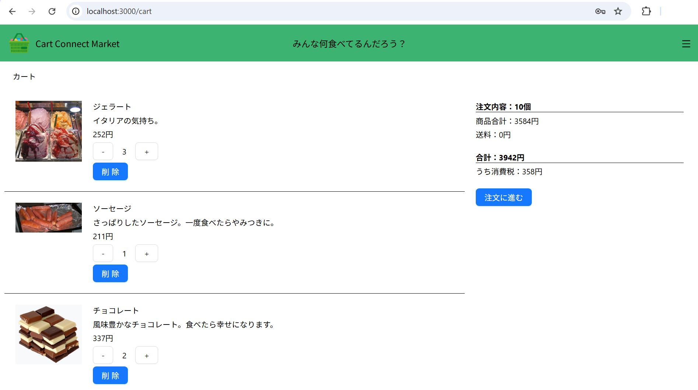
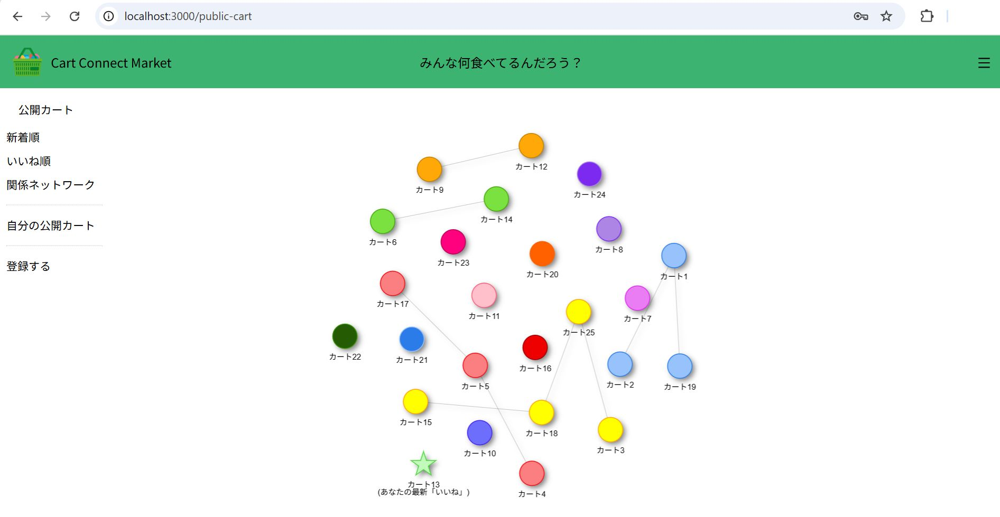
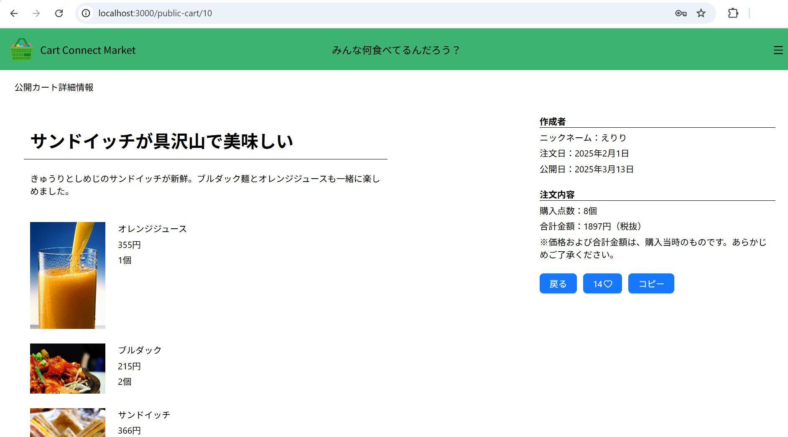

# Cart Connect Market <!-- omit in toc -->

⚠️ **このプロジェクトは作成中です。** 一部の機能が未実装の可能性があります。<br>

2025年7月4日現在、27/28件完了。<br>  
[■■■■■■■■■■■■■■■■■■■■■■■■■■■□]（進捗率：96.42%）

## 目次 <!-- omit in toc -->
- [プロジェクト概要](#プロジェクト概要)
  - [紹介](#紹介)
  - [企画のきっかけ](#企画のきっかけ)
- [主な機能](#主な機能)
- [スクリーンショット](#スクリーンショット)
- [技術スタック](#技術スタック)
  - [開発環境](#開発環境)
  - [フロントエンド](#フロントエンド)
  - [バックエンド](#バックエンド)
- [セットアップ方法](#セットアップ方法)
  - [前提条件](#前提条件)
  - [インストール](#インストール)
- [関連リンク（予定）](#関連リンク予定)

## プロジェクト概要

### 紹介
過去の注文内容を他のユーザーと共有し、「いいね！」でつながるソーシャルショッピングプラットフォームです。ユーザー同士のカートがネットワークで結ばれ、新しいショッピング体験を提供します。

### 企画のきっかけ
一人暮らしの20〜30代がネットスーパーを利用する際に、「何を買えばいいのか」と悩む時間を減らしたいと考え、本プロジェクトを企画しました。<br>
他のユーザーのカートを参考にすることで買い物の判断をサポートし、「いいね！」のデータに基づいたネットワークを通じて、趣味の合うユーザーのカートを発見する楽しさも提供します。

## 主な機能
| 機能名 | 説明 |
|--------|------|
| 🛒 基本的なショッピング機能 | ユーザー登録、ログイン、商品閲覧（カテゴリー別）、カート管理、注文、注文履歴の確認など。 |
| 📤 「公開カート」機能 | 過去の注文を「公開カート」として共有。他のユーザーの公開カートをワンクリックで自分のカートにコピー可能。 |
| 👍 いいね！機能 | 気に入った公開カートに「いいね！」をつけて評価。 |
| 🕸️ 公開カートネットワーク | すべての会員の「いいね！」履歴に基づいてネットワークを生成。ログインユーザーは最近「いいね」したカートがどのノードにつながっているか確認可能。趣味の似たカートを見つけやすくなります。|

## スクリーンショット
- カート画面


- 公開カートネットワーク画面


- 公開カート詳細画面


## 技術スタック
### 開発環境
- MySQL 8.4 LTS
- Windows 11
- Ubuntu 24.04.1 LTS (Noble Numbat)

### フロントエンド
- JavaScript, HTML, CSS
- Next.js, React
- Redux + Redux-Saga
- Ant Designなど

### バックエンド
- Express.js
- Sequelize (ORM)
- bcryptなど

## セットアップ方法

### 前提条件
- 上記の開発環境と同様の構成であること

### インストール
- Development環境の準備方法のみを説明します。

```bash
# リポジトリをクローン
git clone https://github.com/sarifor/cart-connect-market.git
cd cart-connect-market

# npmパッケージをインストール
cd front
npm install
cd back
npm install

# データベースを作成
CREATE DATABASE `mysql_ccm_dev` /*!40100 DEFAULT CHARACTER SET utf8mb4 COLLATE utf8mb4_0900_ai_ci */ /*!80016 DEFAULT ENCRYPTION='N' */;

# 環境変数ファイルを作成
cd back
touch .env.development

# 環境変数の追加
DB_NAME = 'mysql_ccm_dev'
DB_USER = 'root'
DB_HOST = 'localhost'
DB_PASSWORD = ご自身のMySQLパスワード
SESSION_SECRET = 安全なランダム文字列

# アプリケーションを起動
cd front
npm run dev
cd back
npm run dev（DB初期化とダミーデータ挿入が自動実行されます）

# ブラウザでアクセス
http://localhost:3000

```

## 関連リンク（予定）
- [ポートフォリオ]()
- [企画書・設計書]()
- [回顧録]()
