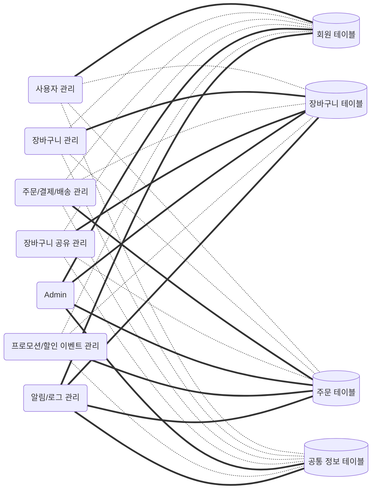

# 데이터 아키텍처

## 데이터 저장 정책
- 각 데이터 테이블은 특정 서브 시스템이 소유하며, 해당 서브 시스템만 업데이트 권한을 가진다.
- 다른 서브 시스템은 데이터를 참조할 수 있으나, 수정 권한은 없다.
- 공통으로 필요한 데이터는 공통 정보 테이블에 배치하여 모든 서브 시스템이 참조할 수 있게 설계한다.

----
## 데이터 아키텍처 다이어그램

- 실선: 참조/업데이트 
- 점선: 참조 전용

----

## 업데이트 범위

|서브 시스템|데이터 테이블|업데이트 범위|필드명|
|----|----|----|----|
|장바구니 공유 관리|장바구니 테이블|공유 관련 데이터에만 | TBD |
|Admin|공통 정보 테이블|동적 데이터에만 | TBD |
|프로모션/할인 이벤트 관리|주문 테이블|프로모션/할인 관련 데이터에만 | TBD |
|알림/로그 관리|회원 테이블|알림/로그 관련 데이터에만 | TBD |
|알림/로그 관리|장바구니 테이블|알림/로그 관련 데이터에만 | TBD |
|알림/로그 관리|주문 테이블|알림/로그 관련 데이터에만 | TBD |
|알림/로그 관리|공통 정보 테이블|알림/로그 관련 데이터에만 | TBD |