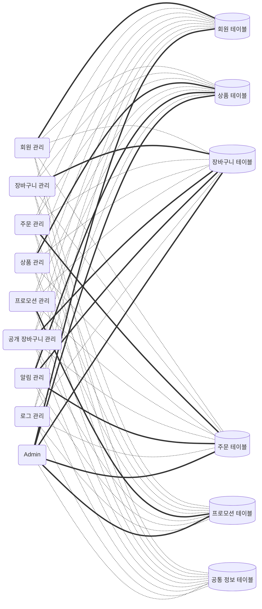

# 소개
데이터 아키텍처

# 데이터 저장 정책
- 각 데이터 테이블은 특정 서브 시스템이 소유하며, 해당 서브 시스템만 업데이트 권한을 가진다.
- 다른 서브 시스템은 테이블을 참조할 수 있으나, 수정 권한은 없다.
- 공통으로 필요한 데이터는 공통 정보 테이블에 배치하여 모든 서브 시스템이 참조할 수 있게 설계한다.

----
# 데이터 아키텍처 다이어그램

- 실선: 참조/업데이트 
- 점선: 참조 전용

----

# 업데이트 범위

| 서브 시스템 | 데이터 테이블 | 업데이트 범위 | 필드명 | 비고 |
|----|----|----|----|----|
| 회원 관리 | 회원 테이블 | 전부 | TBD | N/A |
| 장바구니 관리 | 장바구니 테이블 | 전부 | TBD | N/A |
| 주문 관리 | 주문 테이블 | 전부 | TBD | N/A |
| 상품 관리 | 상품 테이블 | 전부 | TBD | N/A |
| 프로모션 관리 | 프로모션 테이블 | 전부 | TBD | N/A |
| 공개 장바구니 관리 | 장바구니 테이블 | 공개, 로그 관련 데이터에만 | TBD | N/A |
| 알림 관리 | 장바구니 테이블, 주문 테이블, 상품 테이블 | 알림, 로그 관련 데이터에만 | TBD | N/A |
| 로그 관리 | N/A | N/A | N/A | N/A |
| Admin | 회원 테이블, 상품 테이블, 장바구니 테이블, 주문 테이블, 프로모션 테이블 | 일부(예: 회원의 닉네임 수정) | TBD | N/A |