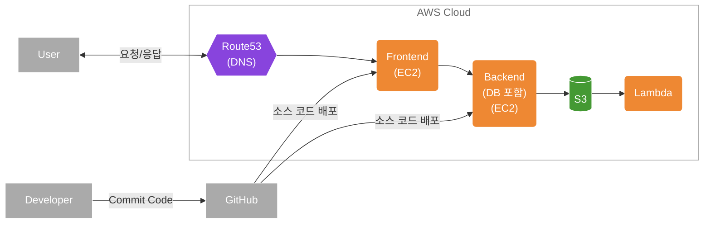

# 소개
인프라 아키텍처

# 인프라 아키텍처 다이어그램

```mermaid
%% 참고
%% - AWS 다이어그램 작성법: https://qiita.com/b-mente/items/b17275090176d63d1d69
%% - 프로젝트 배포법: Nodebird 앱 배포법
%% Q. 그냥 draw.io로 작성할까?

flowchart LR

subgraph AWS[AWS Cloud]
  Route53{{"Route53<br/>(DNS)"}}
  Frontend("Frontend<br/>(EC2)")
  Backend("Backend<br/>(DB 포함)<br/>(EC2)")
  S3[(S3)]
  Lambda(Lambda)
end


User[User]
Developer[Developer]
GitHub[GitHub]

User <--요청/응답--> Route53
Route53 --> Frontend
Frontend --> Backend
Backend --> S3
S3 --> Lambda
GitHub --소스 코드 배포--> Frontend
GitHub --소스 코드 배포--> Backend
Developer --Commit Code--> GitHub

%% 外部要素のスタイル
classDef Out fill:#aaa,color:#fff,stroke:#fff
class User,Developer,GitHub Out

%% Network関連のスタイル
classDef NetworkStyle fill:#84d,color:#fff,stroke:none
class Route53 NetworkStyle

%% Compute関連のスタイル
classDef ComputeStyle fill:#e83,color:#fff,stroke:none
class Frontend,Backend,Lambda ComputeStyle

%% Storage関連のスタイル
classDef StorageStyle fill:#493,color:#fff,stroke:#fff
class S3 StorageStyle

%% グループのスタイル
classDef GroupStyle fill:none,color:#666,stroke:#aaa
class AWS GroupStyle
```