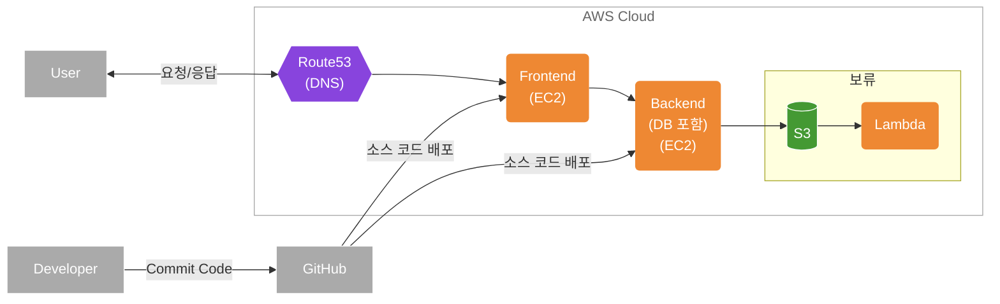

# 소개
인프라 아키텍처

# 인프라 아키텍처 다이어그램

<!--
흐름:
사용자 → sarifor.net → Route 53 → 프론트 Elastic IP → 프론트 EC2 → 백엔드 Elastic IP → 백엔드 EC2 → DB 연동

1단계: 도메인 (sarifor.net) → 사용자 진입 URL
2단계: Route 53 → DNS 레코드 관리
3단계: 프론트 Elastic IP → 고정 공개 IP
4단계: 프론트 EC2 → React/Next.js 실행 서버
5단계: 백엔드 Elastic IP → 백엔드용 고정 IP 
6단계: 백엔드 EC2 → Node.js/Express 서버

(ChatGPT)
-->